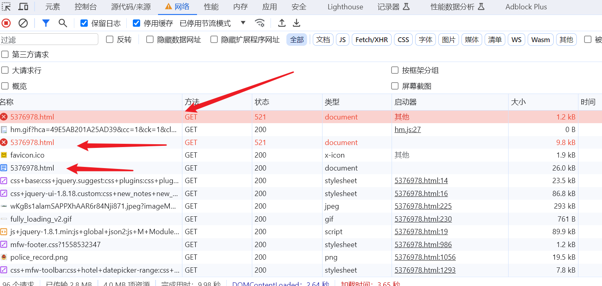
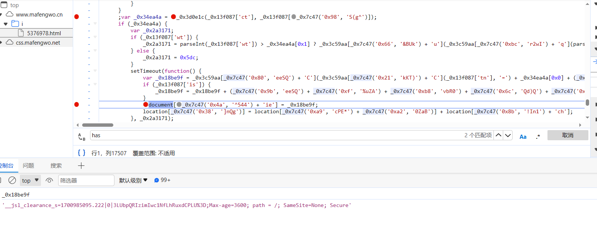

## COOKIE反爬-1

**学习目标:**

1. 熟悉 响应cookie参数传递方式
2. 熟悉 多层数据请求过程
3. 熟悉 阿里系cookie处理方法
4. 熟悉 加速乐cookie处理方式


### 一.常见COOKIE反爬

#### 1. 简介

- Cookie 反爬虫指的是服务器端通过校验请求头中的 Cookie 值来区分正常用户和爬虫程序的手段，这种

  手段被广泛应用在 Web 应用中。

#### 2. 加密原理


- cookie加密分为大致两种方式	
  - 浏览器向服务器发送请求,服务器在响应头带上响应cookie,下次请求的时候需要再带上cookie去进行请求
  - 浏览器向服务器发送请求,服务器返回的是一段js代码,浏览器需要解析js代码,在通过js代码在生成cookie信息


### 二.实战案例

#### 1. 服务器响应cookie信息

- 学习响应cookie和session的处理
- 学习基于首页返回的cookie值

##### 1. 逆向目标

- 地址：http://www.zjmazhang.gov.cn/hdjlpt/published?via=pc

- 接口：http://www.zjmazhang.gov.cn/hdjlpt/letter/pubList

- 对抗： cookie 反爬虫处理

##### 2. 逆向分析

- 可以先测试当前网站的接口,可以发现,当前的接口需要一个cookie值,一个token值


- `X-CSRF-TOKEN` 定位, 参数是在页面写死的,所以我需要先请求这个页面一次,在页面上或者这个值


- 定位cookie生成的位置,逆向cookie的时候,一定要先把页面的cookie清除掉之后再刷新,不然cooki可能在之前就已经生成了
- 当前的cookie是请求首页之后,获取到的服务器响应的数据,那我们的代码就需要先请求首页,获取cookie值,在请求对应的接口


##### 3. 逆向结果

```
import requests
import re
headers = {
    "User-Agent": "Mozilla/5.0 (Windows NT 10.0; Win64; x64) AppleWebKit/537.36 (KHTML, like Gecko) Chrome/119.0.0.0 Safari/537.36",
}

def get_cookie():
    url = 'http://www.zjmazhang.gov.cn/hdjlpt/published?via=pc'
    response = requests.get(url, headers=headers)
    szxx_session = response.cookies.get('szxx_session')
    CSRF = re.findall("var _CSRF = '(.*?)';", response.text)
    return szxx_session, CSRF


def get_data():
    szxx_session, CSRF = get_cookie()
    cookies = {
        "szxx_session": szxx_session
    }
    headers['X-Csrf-Token'] = CSRF[0]
    url = "http://www.zjmazhang.gov.cn/hdjlpt/letter/pubList"
    data = {
        "offset": "0",
        "limit": "20",
        "site_id": "759010",
        "time_from": "1669392000",
        "time_to": "1700582399"
    }
    response = requests.post(url, headers=headers, cookies=cookies, data=data, verify=False)

    print(response.text)
    print(response)

get_data()
```


#### 2. 加速乐系列cookie逆向

##### 1. 逆向目标

- 首页：https://www.cnvd.org.cn/flaw/typelist?typeId=27

- 目标：cookie： __jsl_clearance_s

##### 2. 逆向分析

- 加速乐cookie加密的特性   
- cookie关键字的名称:`__jsl_clearance_s` 里面会有`jsl`的字样
- 会对网址请求3次,前两次都是512的响应状态码,后面会响应正确的200 



- 这样的数据在抓包工具中查看预览一般不会显示数据,我们不好抓包调试,可以直接用过工具来抓对应的数据包

- 第一次会返回一个js代码,这个js代码可以直接通过eval来执行,会给我们返回一个cookie值,需要带上这个cookie值在去请求这个对应的接口


- 拿到响应的cookie,在拿到这一段js代码生成的cookie,在对当前接口发送请求,会返回另外一段js代码,我们需要再执行这一段js代码,会给我们返回一个新的cookie值,在去请求就会给我们返回正确的数据


- 前面一次js其实非常简单,主要是后面返回的js代码,我们需要去着重分析,想调试当前代码,我们需要把浏览器抓包的,脚步一栏打开,他可以帮助我们去拦截js所有执行的文件,他是不会给我们自动断点的


- 在第二次执行的位置同样的去进行定位,可以看到,当前网址调用的是一个go方法,数据内容应该是在go里面生成的,我们可以把断点下再函数内部


- 进过调试我们可以看出来,他的执行最终生成的当前这个数据



- 根据`ha`的参数用的加密方式也不一样,加速乐一般有md5,sha1, sha256,我们都需要考虑到

##### 3.逆向结果

- JavaScript代码

```JavaScript
window = global;
navigator = {}
document = {}
location = {}
navigator.userAgent = 'Mozilla/5.0 (Windows NT 10.0; Win64; x64) AppleWebKit/537.36 (KHTML, like Gecko) Chrome/119.0.0.0 Safari/537.36 Edg/119.0.0.0'
var _0x230c = ['wqjDl17CgQ==', 'wqMWw4hp', 'w7Nuw4I=', 'OcKaP8OR', 'cMOMLMO9', 'w4g4YsOb', 'VMOgwr7Cvg==', 'MA7DlQ==', 'wpEPNsK3', 'wobDmcO3w4I=', 'w7TDumzCqg==', 'wpwaw6wr', 'w6dPwpIq', 'wpkHLsKy', 'w7rDosO8w6w=', 'AMKpf8OM', 'w4LDrMOPw7U=', 'wrfDkMOnw40=', 'A8KlXcOL', 'w6lnQFY=', 'wqXDtMO2w6s=', 'w5XDrE3CiQ==', 'woYHBQE=', 'w5PDgEtZ', 'w6BSwoVP', 'Wz3CoDQ=', 'wpBpwrkm', 'wo81Tjs=', 'HQ7DrhI=', 'SDbCvDU=', 'woISQSI=', 'w5DDuks=', 'wrwAIz4=', 'w6nCgVQ4', 'wrMtQws=', 'dcKsNMOV', 'w7XDiEhG', 'w6kwWMOd', 'HcKSLjo=', 'KhXDlz0=', 'L8KKM8OM', 'w4gpw5nDvQ==', 'woHDlyrCqA==', 'w4fDtUhB', 'wq7CjkpK', 'w7QYw5PCtQ==', 'wqzCusKvwog=', 'w7Z7w4XDpQ==', 'wo3CoMKowps=', 'w7RKw47Dhg==', 'DWV3woQ=', 'wo/DgWZ9', 'wr/CnMOSw7Y=', 'wr9pwptr', 'w6tdwpEc', 'GcKWGS0=', 'YMKyw6XCtw==', 'w5DDqMOow6A=', 'P8KYKMO3', 'wrg3w4QI', 'w5XDmsO3w70=', 'wr0Hw7Nn', 'wp7DsMOVw4A=', 'wq7CgcKEwq0=', 'wrDCjXJp', 'wosfKcKK', 'w5lcwrBW', 'dsKiw6nCig==', 'woXDnX7ChQ==', 'wpLDl8OOw7Y=', 'G0sCDg==', 'w41YwqVL', 'HsKMasOe', 'AcO5w4TCpQ==', 'wodnw4V6', 'KMOiw6vCkA==', 'wqc6bhc=', 'w5/Cp8KkRg==', 'wpjChcO+w4A=', 'D0sAHA==', 'wo4SJCM=', 'wpl2NTo=', 'w4bDj8OIw7M=', 'wpXDrhvClQ==', 'w4DCnMOUw4w=', 'wrU1RSk=', 'XsO+M8OO', 'w6NLwpVo', 'w5AWeQ4=', 'wpjDpcOmw6w=', 'wpAqNig=', 'w60FZ8OG', 'MFfDviw=', 'VcOsw4bCgg==', 'EEEHDw==', 'wo7DmWTCjQ==', 'wos/w6sL', 'w6cLScOX', 'S8OxwpXCmw==', 'V8KCw7zCng==', 'K8KiW8Oh', 'Z8KVw6TCiw==', 'wpXCsMODw50=', 'wqUPLh0=', 'w7zDjcOYw6w=', 'w601ScOU', 'aCfChw4=', 'w7LDoMOzw4M=', 'VcO8wrfCsA==', 'AMKuesOC', 'csOSOsOb', 'JxbDiB4=', 'w7PDuMOow68=', 'RcKifDM=', 'wpDDlXzCjw==', 'G8O6w5HCqQ==', 'w6wiTsO/', 'wp1nwqle', 'w6lXH3Q=', 'EMO/w4TCgQ==', 'w6Nbw4zDqA==', 'wosdw7k8', 'wpzDiC7CjA==', 'Lnh0wpk=', 'w4LDuF/Ckg==', 'wrvDlmfCiA==', 'J8K/OB0=', 'w6jDvm/CrA==', 'wqZIIQM=', 'wqQlw7Z4', 'KsOaw4bCnw==', 'W8KaJ8O4', 'LHcjGA==', 'w7xQw40g', 'wpBZMAE=', 'PVfDohE=', 'w5zCuMKhcA==', 'B8KgesOa', 'w4Z0csKa', 'wrzCiGBw', 'wobDkcOuw7o=', 'wr3CtMKYwr4=', 'VsK5w7fCrA==', 'w7lzZ1Q=', 'w4BIw57Dpg==', 'X8OFwpTCkw==', 'wpYLw65n', 'w4JcYcKT', 'wpNBw6B1', 'w63Do8OQw4g=', 'HXF/wqM=', 'K1QKAg==', 'wpnDqx/ClQ==', 'HsKkJR8=', 'wr/Dh0xr', 'w6ZSwphV', 'wp0jw4dJ', 'woXCukdz', 'RsOKwpHChw==', 'wqvCjX5q', 'wrIRw4JD', 'wqhWw61k', 'Qx/CmTI=', 'wpg7w6ki', 'wqfCtUtH', 'QMO2I8Og', 'N8KKDDY=', 'wp4kw7bCig==', 'wrVxf8OT', 'w4PDm8OIw6E=', 'w5DCqsKrUw==', 'VcOKwoTCgQ==', 'w4DDu3Jg', 'XcOjwqLDig==', 'w54oVMOK', 'w5zDmkA=', 'K1AODA==', 'w5BhwpZw', 'G8Olw4DClQ==', 'wo7CuWdM', 'wp0NIMKU', 'wqNtwpxw', 'OsO/w4fChg==', 'wpzCrEfCvw==', 'w4N1wrVR', 'wo5aORE=', 'woPDpcOlw4g=', 'wqwdID8=', 'wp8/Dg4=', 'J8KqQcO8', 'wp0MIA==', 'wqlJwqYp', 'TjHDpH8=', 'w6PDpHPCmA==', 'wq/Ci2d4', '6K6D5rKc6auG6K6O', 'wrjDiCjChQ==', 'G8OZw6rCkw==', 'w4rDtEvCuA==', 'wokvw6R7', 'wqrDm8OPw4k=', 'wrttw6Fq', 'H1hcwro=', 'bAbCggc=', 'AsKQN8OB', 'DMKEJsOK', 'GMK7JCg=', 'wpljED0=', 'woNkwol2', 'wpXCmcOaw7I=', 'w6jCsT0o', 'w5Udw47Csw==', 'wrcmw5wl', 'wo7DiWvCng==', 'CsKgNcOE', 'w4dHw6HDrg==', 'E8KGWMOB'];
(function (_0x30e4eb, _0x230c15) {
    var _0x39296e = function (_0x84be69) {
        while (--_0x84be69) {
            _0x30e4eb['push'](_0x30e4eb['shift']());
        }
    };
    _0x39296e(++_0x230c15);
}(_0x230c, 0x131));
var _0x3929 = function (_0x30e4eb, _0x230c15) {
    _0x30e4eb = _0x30e4eb - 0x0;
    var _0x39296e = _0x230c[_0x30e4eb];
    if (_0x3929['vRXMYA'] === undefined) {
        (function () {
            var _0x58490b;
            try {
                var _0xbe41af = Function('return\x20(function()\x20' + '{}.constructor(\x22return\x20this\x22)(\x20)' + ');');
                _0x58490b = _0xbe41af();
            } catch (_0x4815a5) {
                _0x58490b = window;
            }
            var _0x2a6e8f = 'ABCDEFGHIJKLMNOPQRSTUVWXYZabcdefghijklmnopqrstuvwxyz0123456789+/=';
            _0x58490b['atob'] || (_0x58490b['atob'] = function (_0x4281ab) {
                    var _0x167e4d = String(_0x4281ab)['replace'](/=+$/, '');
                    var _0x5e3551 = '';
                    for (var _0x71a0a4 = 0x0, _0x327aeb, _0x528e14, _0x4c3d63 = 0x0; _0x528e14 = _0x167e4d['charAt'](_0x4c3d63++); ~_0x528e14 && (_0x327aeb = _0x71a0a4 % 0x4 ? _0x327aeb * 0x40 + _0x528e14 : _0x528e14,
                    _0x71a0a4++ % 0x4) ? _0x5e3551 += String['fromCharCode'](0xff & _0x327aeb >> (-0x2 * _0x71a0a4 & 0x6)) : 0x0) {
                        _0x528e14 = _0x2a6e8f['indexOf'](_0x528e14);
                    }
                    return _0x5e3551;
                }
            );
        }());
        var _0x525f40 = function (_0x2abb65, _0x4946f0) {
            var _0x1fb782 = [], _0x47abca = 0x0, _0x1ac699, _0xae943e = '', _0x40e38b = '';
            _0x2abb65 = atob(_0x2abb65);
            for (var _0x3db13a = 0x0, _0x2668a2 = _0x2abb65['length']; _0x3db13a < _0x2668a2; _0x3db13a++) {
                _0x40e38b += '%' + ('00' + _0x2abb65['charCodeAt'](_0x3db13a)['toString'](0x10))['slice'](-0x2);
            }
            _0x2abb65 = decodeURIComponent(_0x40e38b);
            var _0x4483a9;
            for (_0x4483a9 = 0x0; _0x4483a9 < 0x100; _0x4483a9++) {
                _0x1fb782[_0x4483a9] = _0x4483a9;
            }
            for (_0x4483a9 = 0x0; _0x4483a9 < 0x100; _0x4483a9++) {
                _0x47abca = (_0x47abca + _0x1fb782[_0x4483a9] + _0x4946f0['charCodeAt'](_0x4483a9 % _0x4946f0['length'])) % 0x100;
                _0x1ac699 = _0x1fb782[_0x4483a9];
                _0x1fb782[_0x4483a9] = _0x1fb782[_0x47abca];
                _0x1fb782[_0x47abca] = _0x1ac699;
            }
            _0x4483a9 = 0x0;
            _0x47abca = 0x0;
            for (var _0x58296e = 0x0; _0x58296e < _0x2abb65['length']; _0x58296e++) {
                _0x4483a9 = (_0x4483a9 + 0x1) % 0x100;
                _0x47abca = (_0x47abca + _0x1fb782[_0x4483a9]) % 0x100;
                _0x1ac699 = _0x1fb782[_0x4483a9];
                _0x1fb782[_0x4483a9] = _0x1fb782[_0x47abca];
                _0x1fb782[_0x47abca] = _0x1ac699;
                _0xae943e += String['fromCharCode'](_0x2abb65['charCodeAt'](_0x58296e) ^ _0x1fb782[(_0x1fb782[_0x4483a9] + _0x1fb782[_0x47abca]) % 0x100]);
            }
            return _0xae943e;
        };
        _0x3929['uJIGxA'] = _0x525f40;
        _0x3929['madvuK'] = {};
        _0x3929['vRXMYA'] = !![];
    }
    var _0x84be69 = _0x3929['madvuK'][_0x30e4eb];
    if (_0x84be69 === undefined) {
        if (_0x3929['JkyZRo'] === undefined) {
            _0x3929['JkyZRo'] = !![];
        }
        _0x39296e = _0x3929['uJIGxA'](_0x39296e, _0x230c15);
        _0x3929['madvuK'][_0x30e4eb] = _0x39296e;
    } else {
        _0x39296e = _0x84be69;
    }
    return _0x39296e;
};

var cryptojs = require('crypto-js')
hash1 = {
    'sha1': function (_0x25ab0f) {
        return cryptojs.SHA1(_0x25ab0f).toString()
    },
    'md5': function (_0x432264) {
        return cryptojs.MD5(_0x432264).toString()
    },
    'sha256': function (_0x432264) {
        return cryptojs.SHA256(_0x432264).toString()
    },
}

function go(_0x2969fa) {
    if (_0x2969fa['ha'] === 'sha1') {
        hash = hash1['sha1']
    }
    ;

    if (_0x2969fa['ha'] === 'md5') {
        hash = hash1['md5']
    }
    ;
    if (_0x2969fa['ha'] === 'sha256') {
        hash = hash1['sha256']
    }
    ;
    var _0x4abd2e = {};
    _0x4abd2e[_0x3929('0x9d', 'AYmy') + 'l'] = _0x3929('0x23', '!Kne') + _0x3929('0xa0', '@TGe');
    _0x4abd2e[_0x3929('0x15', 'pggg') + 't'] = function (_0x762cda, _0x19f68c) {
        return _0x762cda !== _0x19f68c;
    }
    ;
    _0x4abd2e[_0x3929('0x68', ']aM^') + 'R'] = _0x3929('0x92', 'wjO6') + 'y';
    _0x4abd2e[_0x3929('0xd6', 'Q%hC') + 'a'] = function (_0x4ec35c, _0x4c2bd5) {
        return _0x4ec35c != _0x4c2bd5;
    }
    ;
    _0x4abd2e[_0x3929('0x4c', '4l*q') + 's'] = function (_0x4ccc81, _0x48522a) {
        return _0x4ccc81 < _0x48522a;
    }
    ;
    _0x4abd2e[_0x3929('0xcd', 'Q%hC') + 'G'] = function (_0x20c529, _0x5cee5a) {
        return _0x20c529 + _0x5cee5a;
    }
    ;
    _0x4abd2e[_0x3929('0x14', 'KY4q') + 'w'] = function (_0x5318a5, _0xfea4ef) {
        return _0x5318a5 == _0xfea4ef;
    }
    ;
    _0x4abd2e[_0x3929('0xa5', 'aJ6i') + 'I'] = function (_0x568eff, _0x102832) {
        return _0x568eff + _0x102832;
    }
    ;
    _0x4abd2e[_0x3929('0xca', 'q9J%') + 'x'] = function (_0x2270f4, _0x6d3371) {
        return _0x2270f4 + _0x6d3371;
    }
    ;
    _0x4abd2e[_0x3929('0x27', '@TGe') + 'H'] = function (_0x1bfc37) {
        return _0x1bfc37();
    }
    ;
    _0x4abd2e[_0x3929('0xbc', 'hY2@') + 'a'] = function (_0x8f45fc, _0x31431b, _0x4e5595) {
        return _0x8f45fc(_0x31431b, _0x4e5595);
    }
    ;
    _0x4abd2e[_0x3929('0x5b', '4l*q') + 'K'] = function (_0x5bb08e, _0x471efd) {
        return _0x5bb08e(_0x471efd);
    }
    ;
    _0x4abd2e[_0x3929('0x82', '&B()') + 'g'] = function (_0x4d65f9, _0x497ea4) {
        return _0x4d65f9 - _0x497ea4;
    }
    ;
    _0x4abd2e[_0x3929('0x3d', 'Y4ZS') + 'u'] = function (_0x39ef6f, _0x4a6e3d) {
        return _0x39ef6f(_0x4a6e3d);
    }
    ;
    _0x4abd2e[_0x3929('0x2a', 'q9J%') + 'i'] = _0x3929('0x6b', '@oXL') + '澶辫触';
    var _0x50b9b3 = _0x4abd2e;

    function _0x24c4bd() {
        var _0x170721 = window[_0x3929('0xd4', 'eCr^') + _0x3929('0xc8', 'r&&7') + 'r'][_0x3929('0x5c', 'cdnu') + _0x3929('0xd1', 'POjI') + 't']
            , _0x476953 = [_0x50b9b3[_0x3929('0x8', 'hY2@') + 'l']];
        for (var _0x43a3d3 = 0x0; _0x43a3d3 < _0x476953[_0x3929('0xce', 'EY4@') + 'th']; _0x43a3d3++) {
            if (_0x50b9b3[_0x3929('0x79', '^9Sy') + 't'](_0x50b9b3[_0x3929('0xae', 'r7w*') + 'R'], _0x3929('0x44', '&B()') + 'y')) {
                _0x2fd47a = 0x5dc;
            } else {
                if (_0x50b9b3[_0x3929('0x94', 'bI)c') + 'a'](_0x170721[_0x3929('0x1', 'bKaz') + _0x3929('0x57', '@TGe')](_0x476953[_0x43a3d3]), -0x1)) {
                    return !![];
                }
            }
        }
        if (window[_0x3929('0xc2', 'cdnu') + _0x3929('0x78', 'ipP!') + _0x3929('0x88', 'AYmy')] || window[_0x3929('0x9f', 'Q%hC') + _0x3929('0xa8', 'AYmy')] || window[_0x3929('0x6', '9r[w') + _0x3929('0xb6', 'ipP!')] || window[_0x3929('0x4', 'fl0R') + _0x3929('0xb0', '0uzQ') + 'r'][_0x3929('0x47', '7JuT') + _0x3929('0x1a', '73SP') + 'r'] || window[_0x3929('0xe', '^9Sy') + _0x3929('0xa6', 'eJqJ') + 'r'][_0x3929('0x7e', 'rOjy') + _0x3929('0x6a', '4l*q') + _0x3929('0x95', 'wjO6') + _0x3929('0x7d', '73SP') + 'e'] || window[_0x3929('0x67', 'r7NR') + _0x3929('0xc5', '73SP') + 'r'][_0x3929('0x2', 'POjI') + _0x3929('0x40', 'eCr^') + _0x3929('0x91', 'Y4ZS') + _0x3929('0x7c', 'hY2@') + _0x3929('0xd', ')gwO')]) {
            return !![];
        }
    }
    ;
    if (_0x50b9b3[_0x3929('0x43', 'r&&7') + 'H'](_0x24c4bd)) {
        return;
    }
    var _0xe0483f = new Date();

    function _0x77dc24(_0x9f0d85, _0xb0e863) {
        var _0x583105 = _0x2969fa[_0x3929('0x63', 'POjI') + 's'][_0x3929('0xcb', '$fCO') + 'th'];
        for (var _0x2f70f7 = 0x0; _0x50b9b3[_0x3929('0x72', '!Kne') + 's'](_0x2f70f7, _0x583105); _0x2f70f7++) {
            for (var _0x4eb505 = 0x0; _0x4eb505 < _0x583105; _0x4eb505++) {
                var _0xcdc765 = _0x50b9b3[_0x3929('0xab', 'eCr^') + 'G'](_0x50b9b3[_0x3929('0xc9', 'aMe*') + 'G'](_0x50b9b3[_0x3929('0x59', 'r&&7') + 'G'](_0xb0e863[0x0], _0x2969fa[_0x3929('0xaf', 'sYeo') + 's'][_0x3929('0xa1', 'POjI') + 'tr'](_0x2f70f7, 0x1)), _0x2969fa[_0x3929('0xb7', 'J6WD') + 's'][_0x3929('0xb3', '!Kne') + 'tr'](_0x4eb505, 0x1)), _0xb0e863[0x1]);
                if (_0x50b9b3[_0x3929('0x93', 'aMe*') + 'w'](hash(_0xcdc765), _0x9f0d85)) {
                    return [_0xcdc765, new Date() - _0xe0483f];
                }
            }
        }
    }
    ;var _0xd28f59 = _0x50b9b3[_0x3929('0xbb', 'rOjy') + 'a'](_0x77dc24, _0x2969fa['ct'], _0x2969fa[_0x3929('0x83', '0uzQ')]);

    var _0x2fd47a;
    if (_0x2969fa['wt']) {
        _0x2fd47a = _0x50b9b3[_0x3929('0x10', 'Y4ZS') + 'K'](parseInt, _0x2969fa['wt']) > _0xd28f59[0x1] ? _0x50b9b3[_0x3929('0x58', '9r[w') + 'g'](parseInt(_0x2969fa['wt']), _0xd28f59[0x1]) : 0x1f4;
    } else {
        _0x2fd47a = 0x5dc;
    }
    aaa = function () {
        var _0x4a520b = _0x50b9b3[_0x3929('0x38', '0uzQ') + 'I'](_0x2969fa['tn'] + '=' + _0xd28f59[0x0] + (_0x3929('0xd5', '^9Sy') + _0x3929('0x5', 'q9J%') + '=') + _0x2969fa['vt'], _0x3929('0x75', ']4*G') + _0x3929('0x4f', 'QS$Y') + '\x20/');
        if (_0x2969fa['is']) {
            _0x4a520b = _0x4a520b + (_0x3929('0x50', 'eJqJ') + _0x3929('0xbe', '&B()') + _0x3929('0x2d', 'J6WD') + _0x3929('0x55', 'KY4q') + _0x3929('0xa4', 'rOjy') + _0x3929('0x66', 'cdnu'));
        }
        return _0x4a520b
    }
    // 直接把调用的传参cookie返回出来
    return aaa()
};
console.log(go({
    'bts': ['1700988826.375|0|wlL', 'YRQ%2BCPI3j66S1chcmUZx0Y%3D'],
    'chars': 'LiJqThdVEcgBfXDTWIVBWh',
    'ct': '433afa32e15fba379ea62fe5693a3afe',
    'ha': 'md5',
    'is': true,
    'tn': '__jsl_clearance_s',
    'vt': '3600',
    'wt': '1500'
}));


```

- python代码

```python
import requests
import re
import execjs

headers = {
    'Referer': 'https://www.mafengwo.cn/i/5376978.html',
    'User-Agent': 'Mozilla/5.0 (Windows NT 10.0; Win64; x64) AppleWebKit/537.36 (KHTML, like Gecko) Chrome/119.0.0.0 Safari/537.36 Edg/119.0.0.0'
}
url = 'https://www.mafengwo.cn/i/5376978.html'


def first_request():
    response = requests.get(url, headers=headers)
    coo = re.findall("document.cookie=(.*?);location", response.text)[0]
    # cookie取值之后前面的不用
    __jsl_clearance_s = execjs.eval(coo).split('ance_s=')[-1]
    __jsluid_s = response.cookies.get('__jsluid_s')
    return __jsluid_s, __jsl_clearance_s


def second_request():
    __jsluid_s, __jsl_clearance_s = first_request()
    cookies = {'__jsluid_s': __jsluid_s, '__jsl_clearance_s': __jsl_clearance_s}
    res = requests.get(url, headers=headers, cookies=cookies)
    go_code = execjs.eval(re.findall(';go\((.*?)\)</s', res.text)[0])
    # print(go_code)
    js = execjs.compile(open('test.js', encoding='utf-8').read())
    __jsl_clearance_s = js.call('go', go_code).split('ance_s=')[-1]
    # print(__jsl_clearance_s)
    cookies['__jsl_clearance_s'] = __jsl_clearance_s
    return cookies


def third_request():
    cookies = second_request()
    res = requests.get(url, headers=headers, cookies=cookies)
    print(res.text)
    print(res.request.headers)

third_request()
```

